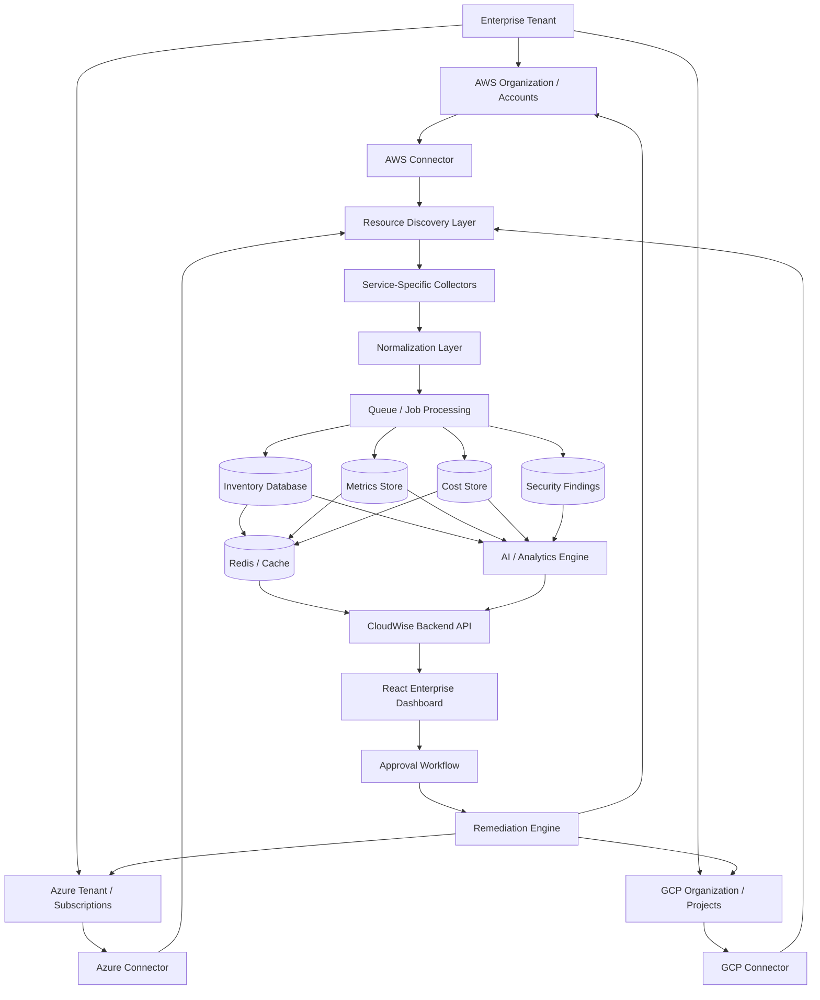

# CloudWise AI — Enterprise Scalability Roadmap

## 1. Purpose

CloudWise AI currently has a working AWS live integration and a unified multi-cloud frontend architecture.

The next goal is to evolve the project from a functional prototype into a platform capable of supporting:

- large corporations,
- multiple cloud accounts,
- thousands or millions of resources,
- AWS Organizations,
- Azure tenants/subscriptions,
- GCP organizations/projects,
- historical telemetry,
- cloud cost management,
- cloud security posture,
- AI-driven recommendations,
- and approval-based automation.

## 2. Target Enterprise Architecture



## 3. Major Architectural Change

The current prototype directly fetches cloud resources when the API is requested. That is acceptable for development, but not for an enterprise customer with many accounts, regions, resources, and dashboard users.

Move from:

```text
Browser
   ↓
CloudWise API
   ↓
Cloud Provider APIs
```

to:

```text
Cloud Providers
      ↓
Background Collectors
      ↓
Database / Cache

Browser
   ↓
CloudWise API
   ↓
Database / Cache
```

Provider synchronization should be independent from dashboard traffic.

## 4. Multi-Tenant Enterprise Model

A tenant represents one customer/company.

```text
Tenant: Example Corporation

├── AWS
│   ├── Production Account
│   ├── Development Account
│   ├── Security Account
│   └── Data Account
│
├── Azure
│   ├── Subscription A
│   └── Subscription B
│
└── GCP
    ├── Production Project
    └── Analytics Project
```

Every resource, metric, cost record, recommendation, and security finding should be scoped to a tenant.

## 5. Recommended Data Model

### tenants

```text
id
name
status
created_at
updated_at
```

### users

```text
id
tenant_id
email
role
status
created_at
```

### cloud_accounts

```text
id
tenant_id
provider
external_account_id
display_name
auth_type
credential_reference
status
last_sync_at
created_at
updated_at
```

### cloud_resources

```text
id
tenant_id
cloud_account_id
provider
service
resource_type
resource_id
resource_arn
resource_name
region
status
tags
metadata
first_seen_at
last_seen_at
last_synced_at
```

### resource_metrics

```text
id
tenant_id
resource_id
metric_name
timestamp
value
unit
```

### resource_costs

```text
id
tenant_id
resource_id
date
cost
currency
```

### security_findings

```text
id
tenant_id
resource_id
provider
severity
finding_type
description
status
detected_at
```

### recommendations

```text
id
tenant_id
resource_id
recommendation_type
priority
estimated_saving
reason
status
created_at
```

## 6. Enterprise AWS Authentication

### Current development method

```text
IAM User
+
Access Key
+
Secret Access Key
```

### Production method

Use:

```text
Cross-Account IAM Role
+
STS AssumeRole
+
External ID
+
Temporary Credentials
```

CloudWise should store references such as:

```text
AWS Account ID
Role ARN
External ID
```

Benefits:

- no permanent customer access keys,
- easier revocation,
- safer credential lifecycle,
- better enterprise governance,
- supports many AWS accounts.

## 7. AWS Organizations Support

Large companies often have many AWS accounts.

```text
AWS Organization
│
├── Production
├── Development
├── Security
├── Networking
└── Data
```

Recommended flow:

```text
AWS Organization
      ↓
Discover accounts
      ↓
Assume CloudWise role in each account
      ↓
Discover resources
      ↓
Normalize
      ↓
Store under same tenant
```

Frontend filters should include:

- organization,
- account,
- organizational unit,
- region,
- service,
- environment,
- tags.

## 8. Generic AWS Resource Discovery

Do not depend only on manually written EC2 discovery.

Introduce:

```text
awsDiscovery.ts
```

Potential discovery sources:

- AWS Resource Explorer,
- AWS Config,
- Resource Groups Tagging API,
- service-specific APIs where deeper information is required.

Recommended pattern:

```text
Generic Discovery
      ↓
Find ARN / service / region / tags
      ↓
Route to matching service adapter
```

## 9. AWS Service Adapter Architecture

Restructure AWS integration into an extensible package:

```text
src/server/services/cloud/aws/

├── awsAuth.ts
├── awsDiscovery.ts
├── awsAccountService.ts
├── awsMetrics.ts
├── awsCost.ts
├── awsSecurity.ts
│
├── collectors/
│   ├── ec2Collector.ts
│   ├── rdsCollector.ts
│   ├── s3Collector.ts
│   ├── lambdaCollector.ts
│   ├── dynamodbCollector.ts
│   ├── ebsCollector.ts
│   ├── elbCollector.ts
│   ├── ecsCollector.ts
│   ├── eksCollector.ts
│   ├── elasticacheCollector.ts
│   ├── redshiftCollector.ts
│   └── genericCollector.ts
│
└── awsNormalizer.ts
```

The current EC2 implementation becomes the first specialized adapter rather than being discarded.

## 10. Collector Registry

Avoid giant `if/else` logic.

Concept:

```typescript
const collectors = {
  EC2: ec2Collector,
  RDS: rdsCollector,
  S3: s3Collector,
  Lambda: lambdaCollector,
  DynamoDB: dynamodbCollector
};
```

Flow:

```text
Discovered resource
      ↓
Detect service
      ↓
Find collector adapter
      ↓
Collect details
      ↓
Normalize
```

If no deep adapter exists, use a generic collector so the resource still appears in inventory with limited detail.

## 11. AWS Services to Prioritize

### Tier 1 — Deep Support

#### Compute
- EC2
- Lambda
- ECS
- EKS

#### Databases
- RDS
- DynamoDB
- ElastiCache

#### Storage
- S3
- EBS

#### Networking
- Elastic Load Balancing

These provide broad coverage across compute, containers, serverless, database, caching, storage, and networking.

### Tier 2

- Redshift
- OpenSearch
- API Gateway
- CloudFront
- Route 53
- NAT Gateway
- VPC resources
- SNS
- SQS
- Step Functions
- Kinesis

### Tier 3

Use generic inventory until specialized support is required.

## 12. Metrics Architecture

Do not hard-code only EC2 CPU.

Build per-service metric profiles.

### EC2

```text
CPUUtilization
NetworkIn
NetworkOut
StatusCheckFailed
```

### RDS

```text
CPUUtilization
DatabaseConnections
FreeStorageSpace
FreeableMemory
```

### Lambda

```text
Invocations
Errors
Duration
Throttles
```

### DynamoDB

```text
ConsumedReadCapacityUnits
ConsumedWriteCapacityUnits
ThrottledRequests
SystemErrors
```

Recommended pattern:

```text
service
  ↓
metric profile
  ↓
CloudWatch batch query
```

Use batch APIs where possible to reduce API calls.

## 13. Cost Management Architecture

Inventory and billing should remain separate subsystems.

Recommended sources:

- AWS Cost Explorer / cost exports,
- Azure Cost Management,
- GCP Cloud Billing exports.

Architecture:

```text
Resource Inventory
      +
Billing Data
      ↓
Cost Correlation Engine
      ↓
Resource / Service / Account Costs
```

Support should eventually include:

- daily spend,
- monthly spend,
- service spend,
- account spend,
- region spend,
- resource-level cost where available,
- budgets,
- forecasts,
- savings opportunities.

## 14. Security Posture Architecture

Enterprise CloudWise should aggregate security findings.

### AWS examples

- AWS Config
- Security Hub
- IAM findings
- GuardDuty findings
- public S3 exposure
- open security groups
- encryption state
- unused credentials

### Azure examples

- Azure Policy
- Defender for Cloud

### GCP examples

- Security Command Center
- organization policies

Normalize findings into one model:

```json
{
  "provider": "AWS",
  "resource_id": "...",
  "finding_type": "PUBLIC_STORAGE",
  "severity": "HIGH",
  "status": "OPEN"
}
```

## 15. Background Synchronization

Dashboard requests should not trigger full provider scans.

Example cadence:

```text
Every 5–15 minutes:
    synchronize resource inventory

Every 5 minutes:
    synchronize key metrics

Every 1–6 hours:
    synchronize cost data

Security:
    scheduled + event-driven updates
```

## 16. Queue-Based Processing

Use asynchronous jobs:

```text
Scheduler
   ↓
Sync AWS Account 123
   ↓
Job Queue
   ↓
Workers
   ├── account A
   ├── account B
   ├── account C
   └── account D
```

Benefits:

- retries,
- horizontal scaling,
- failure isolation,
- provider throttling control,
- parallel processing.

## 17. Rate Limits and Reliability

Collectors must support:

- pagination,
- retries,
- exponential backoff,
- jitter,
- concurrency limits,
- timeout handling,
- partial failures.

A single failed service must not fail an entire account sync.

## 18. Multi-Region Support

Remove hard-coded single-region assumptions such as:

```text
ap-south-1
```

Instead:

```text
Discover enabled regions
      ↓
For each account
      ↓
For each relevant region
      ↓
Collect resources
```

Collectors should also understand whether a service is global or regional.

## 19. Unified Multi-Cloud Normalization

Keep one provider-neutral model.

```json
{
  "tenant_id": "...",
  "provider": "AWS",
  "cloud_account_id": "...",
  "service": "EC2",
  "resource_type": "VirtualMachine",
  "resource_id": "...",
  "name": "...",
  "region": "...",
  "status": "...",
  "tags": {},
  "metrics": {},
  "cost": {},
  "security": {},
  "metadata": {}
}
```

Equivalent services should map into common categories where appropriate:

```text
AWS EC2
Azure Virtual Machine
GCP Compute Engine
        ↓
VirtualMachine
```

## 20. Azure Enterprise Architecture

Recommended pattern:

```text
Azure Tenant
      ↓
Subscriptions
      ↓
Azure Resource Graph
      ↓
Service Adapters
      ↓
Azure Monitor
      ↓
Cost Management
      ↓
Normalizer
```

Initial deep adapters:

- Virtual Machines
- Storage Accounts
- Azure SQL
- AKS
- Functions
- Load Balancers
- Managed Disks

## 21. GCP Enterprise Architecture

Recommended pattern:

```text
GCP Organization
      ↓
Folders
      ↓
Projects
      ↓
Cloud Asset Inventory
      ↓
Service Adapters
      ↓
Cloud Monitoring
      ↓
Cloud Billing
      ↓
Normalizer
```

Initial deep adapters:

- Compute Engine
- Cloud SQL
- Cloud Storage
- GKE
- Cloud Functions / Cloud Run
- Persistent Disk
- Load Balancing

## 22. Cache Layer

Use Redis for frequently requested data such as:

- latest cloud inventory,
- dashboard totals,
- provider counts,
- current anomalies,
- recent recommendations.

Frontend requests should normally read from cache/database rather than provider APIs.

## 23. Historical Metrics Storage

Historical analytics needs durable telemetry storage.

Potential options:

- PostgreSQL + TimescaleDB,
- ClickHouse,
- managed time-series database.

Example schema:

```text
timestamp
resource_id
metric
value
unit
```

This enables trend analysis, anomaly detection, forecasting, and capacity planning.

## 24. AI Pipeline

The AI layer should consume normalized real telemetry.

```text
Cloud Inventory
      +
Historical Metrics
      +
Cost History
      +
Security Findings
      ↓
Feature Pipeline
      ↓
AI / ML
      ├── anomaly detection
      ├── cost forecasting
      ├── rightsizing
      ├── waste detection
      └── root-cause analysis
      ↓
Recommendations
```

The AI model should operate on normalized fields rather than provider-specific field names.

## 25. Controlled Automation and Remediation

Keep live resources read-only until remediation is implemented safely.

Enterprise model:

```text
Recommendation
      ↓
Approval Required
      ↓
Authorized User Approves
      ↓
Automation Service
      ↓
Temporary Privileged Role
      ↓
Cloud Action
      ↓
Audit Log
```

Use separate least-privilege remediation roles rather than reusing monitoring credentials.

## 26. RBAC

Potential roles:

```text
Platform Admin
Cloud Admin
FinOps Analyst
Security Analyst
Viewer
Approver
```

Example permissions:

| Action | Viewer | FinOps | Cloud Admin |
|---|---:|---:|---:|
| View resources | Yes | Yes | Yes |
| View cost | Yes | Yes | Yes |
| Create recommendation | No | Yes | Yes |
| Approve remediation | No | Optional | Yes |
| Connect account | No | No | Yes |

## 27. Secrets Management

Do not store secrets in:

- source code,
- GitHub,
- frontend,
- plaintext database fields.

Use a proper secrets manager or vault and store references in the database.

## 28. Audit Logging

Record:

```text
who
what
when
tenant
resource
old state
new state
approval
result
```

Every remediation action should be traceable.

## 29. CloudWise Self-Observability

Monitor CloudWise itself:

- collector success/failure,
- API latency,
- provider API errors,
- worker queue depth,
- sync duration,
- database latency,
- cache hit rate,
- authentication failures,
- per-tenant resource count.

Use structured logging and correlation IDs.

## 30. Deployment Architecture

Recommended direction:

```text
Load Balancer
      ↓
API Instances
      ↓
Redis
      ↓
PostgreSQL

Job Queue
      ↓
Collector Workers

AI Workers
      ↓
Model Services
```

Containerize components and deploy infrastructure using infrastructure-as-code.

## 31. CI/CD

Recommended pipeline:

```text
Pull Request
    ↓
Lint
    ↓
Type Check
    ↓
Unit Tests
    ↓
Integration Tests
    ↓
Security Scan
    ↓
Build Container
    ↓
Deploy
```

Relevant tooling can include GitHub Actions, Docker, and Terraform.

## 32. Testing Strategy

### Unit tests

Test:

- normalization,
- provider adapters,
- metric mapping,
- cost mapping,
- retry logic.

### Integration tests

Use dedicated cloud test accounts/subscriptions/projects.

### Contract tests

Ensure all providers produce the same normalized schema.

### Failure tests

Simulate:

- expired credentials,
- API throttling,
- unavailable regions,
- missing permissions,
- malformed responses.

## 33. Proposed Implementation Phases

### Phase 1 — Current Foundation

Already achieved:

- AWS connection,
- EC2 discovery,
- CloudWatch CPU,
- normalization,
- unified API,
- live frontend feed.

### Phase 2 — AWS Enterprise Inventory

Implement:

- `awsAuth.ts`
- cross-account role support
- multi-region discovery
- Resource Explorer / Config integration
- service adapter registry
- EC2 adapter migration
- RDS
- S3
- Lambda
- DynamoDB
- EBS
- ELB

### Phase 3 — Persistence

Implement:

- tenants
- cloud accounts
- cloud resources
- resource metrics
- cost history
- sync status
- PostgreSQL
- Redis

Change the frontend to read from CloudWise storage rather than triggering provider scans.

### Phase 4 — Azure Live Integration

Implement tenant/subscription onboarding, Azure Resource Graph, Azure Monitor, normalization, and initial service adapters. Replace Azure demo rows with live data.

### Phase 5 — GCP Live Integration

Implement organization/project onboarding, Cloud Asset Inventory, Cloud Monitoring, normalization, and initial adapters. Replace GCP demo rows with live data.

### Phase 6 — FinOps

Implement:

- AWS cost ingestion,
- Azure cost ingestion,
- GCP billing ingestion,
- cost correlation,
- budgets,
- forecasts,
- waste detection.

### Phase 7 — Security

Implement unified security findings from each provider.

### Phase 8 — AI

Move existing AI modules onto real normalized inventory, metrics, and cost data.

### Phase 9 — Controlled Automation

Implement approvals, remediation roles, execution workers, audit trails, and rollback strategy.

## 34. Recommended Immediate Next Step

Before starting Azure, strengthen AWS into a generic enterprise inventory layer.

Recommended order:

```text
1. Restructure AWS folder
2. Create awsAuth.ts
3. Create awsDiscovery.ts
4. Move current EC2 logic to collectors/ec2Collector.ts
5. Build collector registry
6. Add RDS collector
7. Add S3 collector
8. Add Lambda collector
9. Add DynamoDB collector
10. Add multi-region discovery
11. Introduce persistence
12. Then implement Azure and GCP using the same architecture
```

## 35. Definition of Enterprise-Ready

CloudWise AI can be considered enterprise-ready when it can:

- onboard organizations securely,
- support multiple accounts/subscriptions/projects,
- discover resources across regions,
- handle provider throttling and failures,
- persist inventory independently of user requests,
- maintain historical metrics,
- ingest costs,
- aggregate security posture,
- enforce tenant isolation,
- enforce RBAC,
- provide audit logs,
- scale collectors horizontally,
- survive partial provider failures,
- serve dashboards from database/cache,
- and execute remediation only through explicit approval and least-privilege roles.

## 36. Target End State

```text
                    CLOUDWISE AI

Enterprise Tenant
        │
        ├─────────────┬───────────────┐
        ▼             ▼               ▼
       AWS           Azure            GCP
        │             │               │
        ▼             ▼               ▼
   Discovery      Discovery       Discovery
        │             │               │
        ▼             ▼               ▼
    Adapters        Adapters         Adapters
        │             │               │
        └─────────────┼───────────────┘
                      ▼
                Normalization
                      ▼
               Background Jobs
                      ▼
         Inventory / Metrics / Cost
                      ▼
                   Database
                      ▼
                 Redis Cache
                      ▼
                CloudWise API
                      ▼
           AI + FinOps + Security
                      ▼
                React Dashboard
                      ▼
          Approval-Based Automation
```

This architecture lets the current CloudWise prototype grow into a scalable multi-cloud enterprise platform without discarding the work already completed.
